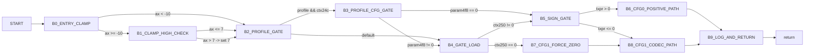

# GetVPcmMinimalTxPowerReduction Control Graph (Address-Backed)

## Control Blocks

| Block | Entry |
|---|---:|
| `B0_ENTRY_CLAMP` | `0x7aa0` |
| `B1_CLAMP_HIGH_CHECK` | `0x7ba0` |
| `B2_PROFILE_GATE` | `0x7ad9` |
| `B3_PROFILE_CFG_GATE` | `0x7bf0` |
| `B4_GATE_LOAD` | `0x7af1` |
| `B5_SIGN_GATE` | `0x7b07` |
| `B6_CFG0_POSITIVE_PATH` | `0x7b10` |
| `B7_CFG1_FORCE_ZERO` | `0x7bb4` |
| `B8_CFG1_CODEC_PATH` | `0x7bb6` |
| `B9_LOG_AND_RETURN` | `0x7b39` |

