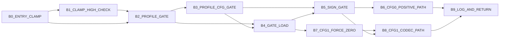
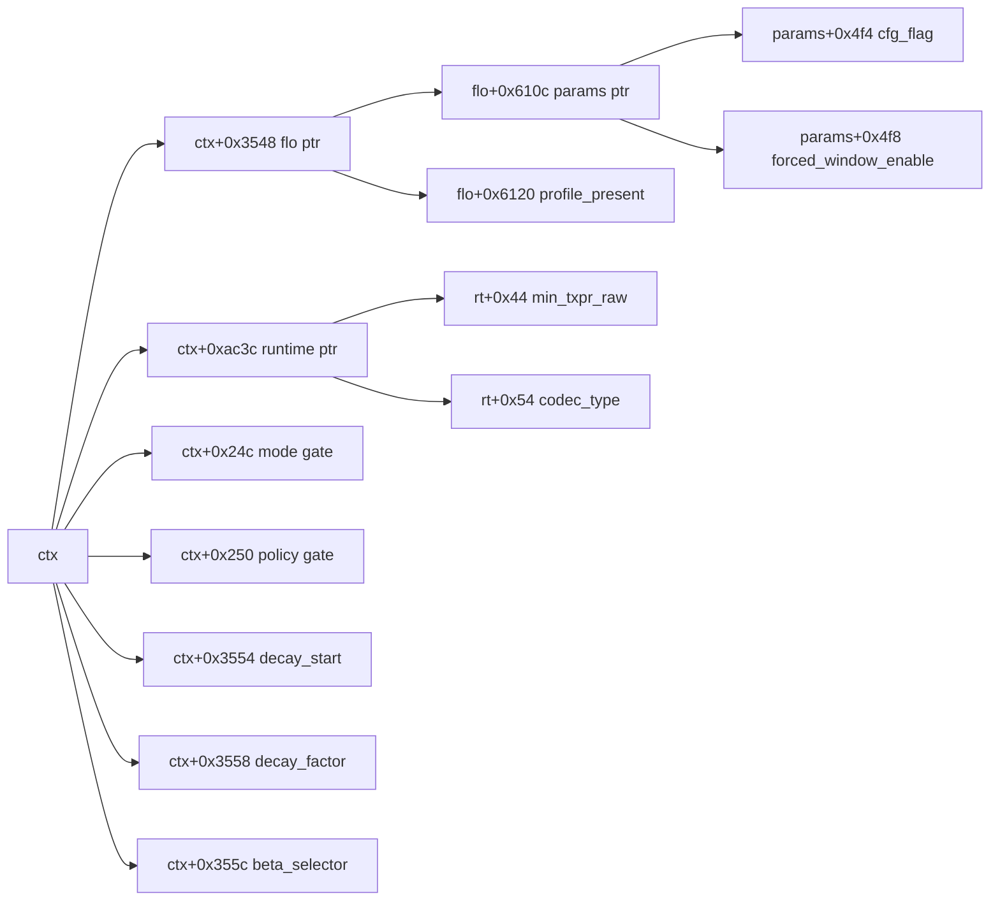
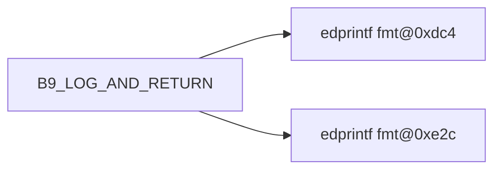

# GetVPcmMinimalTxPowerReduction 3-Plane Graph (Control/Params/Calls)

References:
- Control graph: `/root/D-Modem/doc/GetVPcmMinimalTxPowerReduction_state_graph.md`
- Control edge CSV: `/root/D-Modem/doc/GetVPcmMinimalTxPowerReduction_state_graph_edges.csv`
- Param edge CSV: `/root/D-Modem/doc/GetVPcmMinimalTxPowerReduction_state_graph_param_edges.csv`

## Control Plane

## Parameter Plane

## Call Plane

