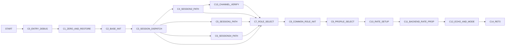

# VPcmV34Create Control Graph (Address-Backed)

## Control Blocks

| Block | Entry |
|---|---:|
| `C0_ENTRY_DEBUG` | `0xaa70` |
| `C1_ZERO_AND_RESTORE` | `0xaac7` |
| `C2_BASE_INIT` | `0xab1b` |
| `C3_SESSION_DISPATCH` | `0xac18` |
| `C4_SESSION2_PATH` | `0xafc6` |
| `C5_SESSION1_PATH` | `0xb0a0` |
| `C6_SESSION34_PATH` | `0xb320` |
| `C7_ROLE_SELECT` | `0xac76` |
| `C8_COMMON_ROLE_INIT` | `0xac87` |
| `C9_PROFILE_SELECT` | `0xad8d` |
| `C10_RATE_SETUP` | `0xae31` |
| `C11_BACKEND_RATE_PROP` | `0xae68` |
| `C12_ECHO_AND_MODE` | `0xaf55` |
| `C13_CHANNEL_VERIFY` | `0xb382` |
| `C14_RET0` | `0xafbc` |

