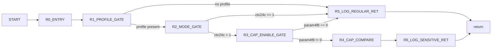

# VPcmV34GetMaxUpstreamRateIndex Control Graph (Address-Backed)

## Control Blocks

| Block | Entry |
|---|---:|
| `R0_ENTRY` | `0x7c10` |
| `R1_PROFILE_GATE` | `0x7c30` |
| `R2_MODE_GATE` | `0x7c34` |
| `R3_CAP_ENABLE_GATE` | `0x7c54` |
| `R4_CAP_COMPARE` | `0x7c64` |
| `R5_LOG_REGULAR_RET` | `0x7c3d` |
| `R6_LOG_SENSITIVE_RET` | `0x7c74` |

