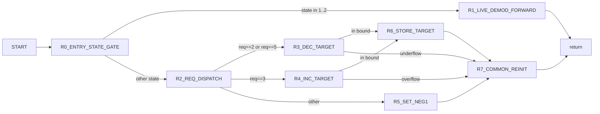

# VPcmV34InitiateRateRenegotiation Control Graph (Address-Backed)

## Control Blocks

| Block | Entry |
|---|---:|
| `R0_ENTRY_STATE_GATE` | `0x6530` |
| `R1_LIVE_DEMOD_FORWARD` | `0x655e` |
| `R2_REQ_DISPATCH` | `0x6580` |
| `R3_DEC_TARGET` | `0x6600` |
| `R4_INC_TARGET` | `0x661e` |
| `R5_SET_NEG1` | `0x6599` |
| `R6_STORE_TARGET` | `0x660f` |
| `R7_COMMON_REINIT` | `0x65a4` |

