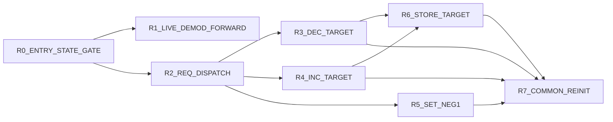
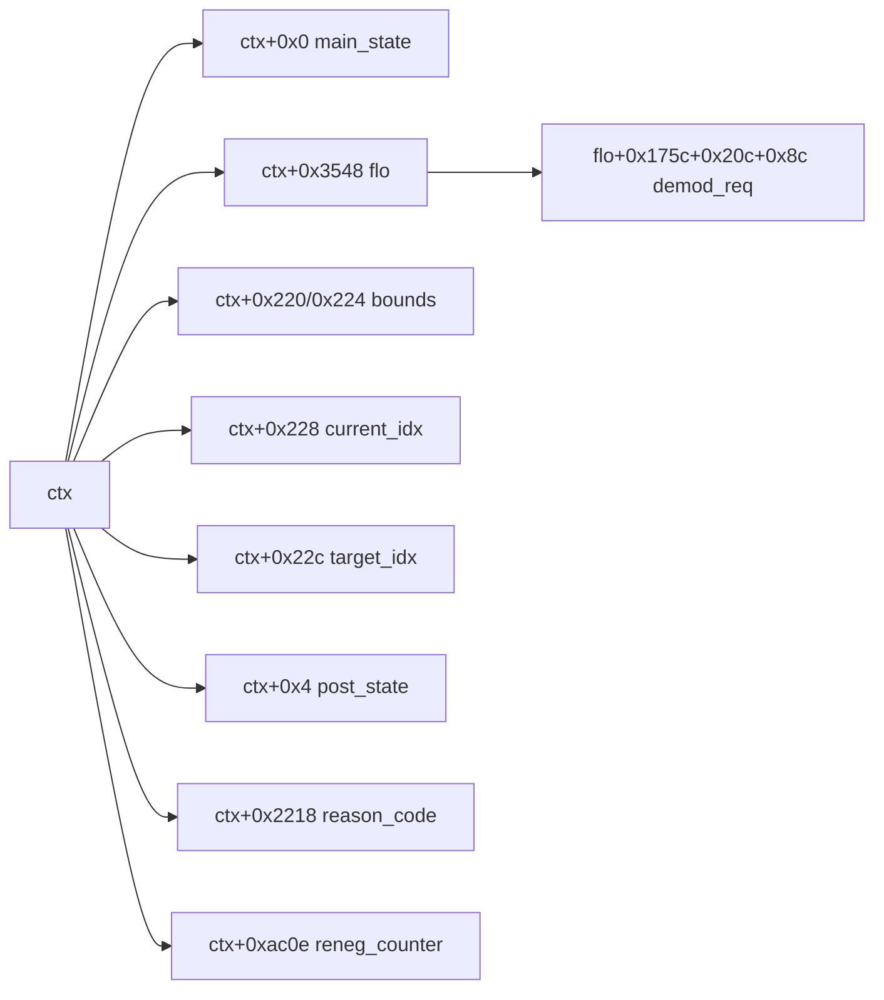

# VPcmV34InitiateRateRenegotiation 3-Plane Graph (Control/Params/Calls)

References:
- Control graph: `/root/D-Modem/doc/VPcmV34InitiateRateRenegotiation_state_graph.md`
- Control edge CSV: `/root/D-Modem/doc/VPcmV34InitiateRateRenegotiation_state_graph_edges.csv`
- Param edge CSV: `/root/D-Modem/doc/VPcmV34InitiateRateRenegotiation_state_graph_param_edges.csv`

## Control Plane



## Parameter Plane



## Call Plane

```mermaid
flowchart LR
  K0[R7_COMMON_REINIT] --> K1[v34handshakinit(ctx,2)]
```
