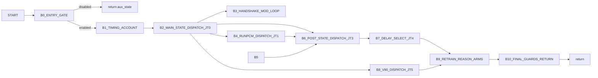

# VPcmV34Progress Control Graph (Address-Backed)

## Control Blocks

| Block | Entry |
|---|---:|
| `B0_ENTRY_GATE` | `0x0000b3c0` |
| `B1_TIMING_ACCOUNT` | `0x0000b420` |
| `B2_MAIN_STATE_DISPATCH_JT0` | `0x0000b4f4` |
| `B3_HANDSHAKE_MOD_LOOP` | `0x0000bb7c` |
| `B4_RUNPCM_DISPATCH_JT1` | `0x0000bc39` |
| `B5_K56_DISPATCH_JT2` | `0x0000c0f3` |
| `B6_POST_STATE_DISPATCH_JT3` | `0x0000c24b` |
| `B7_DELAY_SELECT_JT4` | `0x0000c49c` |
| `B8_V90_DISPATCH_JT5` | `0x0000c805` |
| `B9_RETRAIN_REASON_ARMS` | `0x0000ca07` |
| `B10_FINAL_GUARDS_RETURN` | `0x0000ce40` |

