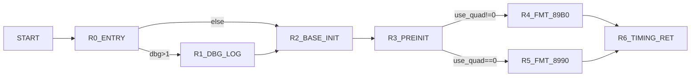

# VPcmV34SetV90RateReneg Control Graph (Address-Backed)

## Control Blocks

| Block | Entry |
|---|---:|
| `R0_ENTRY` | `0xa130` |
| `R1_DBG_LOG` | `0xa226` |
| `R2_BASE_INIT` | `0xa16b` |
| `R3_PREINIT` | `0xa1b2` |
| `R4_FMT_89B0` | `0xa1da` |
| `R5_FMT_8990` | `0xa218` |
| `R6_TIMING_RET` | `0xa1e6` |

