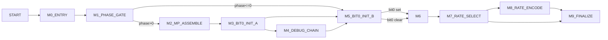

# getMPrecvdBits Control Graph (Address-Backed)

## Control Blocks

| Block | Entry |
|---|---:|
| `M0_ENTRY` | `0x9250` |
| `M1_PHASE_GATE` | `0x926c` |
| `M2_MP_ASSEMBLE` | `0x927a` |
| `M3_BIT0_INIT_A` | `0x9313` |
| `M4_DEBUG_CHAIN` | `0x94cb` |
| `M5_BIT0_INIT_B` | `0x9333` |
| `M6_RENEG_BASE` | `0x933c` |
| `M7_RATE_SELECT` | `0x9369` |
| `M8_RATE_ENCODE` | `0x93d0` |
| `M9_FINALIZE` | `0x9461` |

