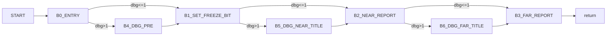

# v34FreezeEcho Control Graph (Address-Backed)

## Control Blocks

| Block | Entry |
|---|---:|
| `B0_ENTRY` | `0x5e200` |
| `B1_SET_FREEZE_BIT` | `0x5e21a` |
| `B2_NEAR_REPORT` | `0x5e230` |
| `B3_FAR_REPORT` | `0x5e247` |
| `B4_DBG_PRE` | `0x5e260` |
| `B5_DBG_NEAR_TITLE` | `0x5e290` |
| `B6_DBG_FAR_TITLE` | `0x5e2c0` |

