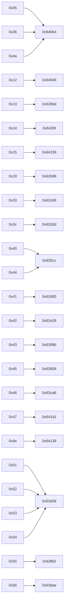
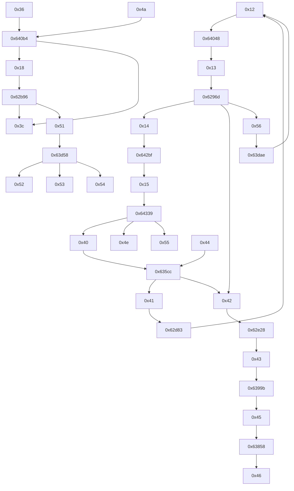

# v34handshak TX State Graph (Address-Backed)

This graph is organized exactly as requested:

- `from_state -> dispatch_target -> next_state(s)`
- Dispatch targets come from jump table A (`.rodata+0x2da0`) at `0x62966`.
- Next-state edges are backed by concrete assignment sites (`mov WORD PTR [..+0x3596], imm_reg`).

## 1) State -> Dispatch Target (Exact)

## 2) Dispatch Target -> Next TX State(s) (Evidence-Backed)

Legend:
- `H` high confidence (path-specific and consistent with behavior)
- `M` medium confidence (shared handler/downstream but still strong)

| Dispatch target | Next TX state | Evidence assignment addr | Confidence | Notes |
|---:|---:|---:|---|---|
| `0x64048` (`TX 0x12`) | `0x13` | `0x66d39` | H | End of S/Sbar-A burst (`count==0x40`) transitions to S/Sbar-B |
| `0x642bf` (`TX 0x14`) | `0x15` | `0x68148` | H | PP complete transitions to J transmit |
| `0x64339` (`TX 0x15`) | `0x40` | `0x64b52` | H | J interval reaches target, enters J-bar |
| `0x64339` (`TX 0x15`) | `0x4e` | `0x64e08` | H | V.90 JA branch |
| `0x64339` (`TX 0x15`) | `0x55` | `0x67fb9` | H | K56 JA branch |
| `0x62e28` (`TX 0x42`) | `0x43` | `0x634d9`/`0x634de` | H | MP setup path enters MP_BITS |
| `0x6399b` (`TX 0x43`) | `0x45` | `0x648e7`/`0x648ec` | H | MP bits complete to E sequence |
| `0x63858` (`TX 0x45`) | `0x46` | `0x66e33`/`0x66e38` | H | E complete to DATA |
| `0x63dae` (`TX 0x56`) | `0x12` | `0x63f36`/`0x63f3b` | H | MD complete path back to S/Sbar-A |
| `0x62d83` (`TX 0x41`) | `0x12` | `0x62df9`/`0x62dfe` | H | Drop-wait returns to S/Sbar-A |
| `0x635cc` (`TX 0x40/0x44`) | `0x41` | `0x66cf9`/`0x66cfe` | H | J/J1 branch to drop-wait |
| `0x635cc` (`TX 0x44`) | `0x42` | `0x6722a`/`0x6722f` | M | J1/forced branch back into MP |
| `0x640b4` (`TX 0x36`) | `0x18` | `0x6584b`/`0x65850` | H | INFO preamble to INFO bits |
| `0x640b4` (`TX 0x4a`) | `0x3c` | `0x66c26`/`0x66c2b` | H | Silence retrain done -> HOLD |
| `0x6296d` (`TX 0x13`) | `0x14` | `0x683a1`/`0x683a6` | M | Normal S/Sbar-B exit to PP |
| `0x6296d` (`TX 0x13`) | `0x56` | `0x67879`/`0x6787e` | M | MD branch selected |
| `0x6296d` (`TX 0x13`) | `0x42` | `0x6722a`/`0x6722f` | M | Alternate branch into MP |
| `0x62b96` (`TX 0x18`) | `0x3c` | `0x65509`/`0x6550e` | H | End-of-message non-MOH path |
| `0x62b96` (`TX 0x18`) | `0x51` | `0x68a1e`/`0x68a23` | M | MOH silence entry |
| `0x63d58` (`TX 0x51`) | `0x52` | `0x66de0`/`0x66de5` | M | MOH wait branch |
| `0x63d58` (`TX 0x51`) | `0x53` | `0x68b01`/`0x68b06` | M | MOH cleardown branch |
| `0x63d58` (`TX 0x52/0x53/...`) | `0x54` | `0x64f31`/`0x64f36` and `0x6506e`/`0x65073` | H | MOH disconnect/timeout branch |
| `0x63ca8` (`TX 0x46`) | *(stays / exits to data mode)* | N/A | H | Data-mode handoff; no mandatory immediate TX-state rewrite |
| `0x63fb0` (`TX 0x55`) | *(internal K56 phase)* | N/A | M | Delegates to `k56FlexPhase34`; transition may happen elsewhere |
| `0x64139` (`TX 0x4e`) | *(internal V.90 phase)* | N/A | M | Delegates to `v90Phase34`; transition may happen elsewhere |
| `0x641d1` (`TX 0x47`) | *(marker path dependent)* | N/A | M | Retrain marker generator; downstream transition is condition-driven |
| `0x62d3d` (`TX 0x3c`) | `0x05` / `0x12` | `0x695b8`/`0x695bd`, `0x68f3e`/`0x68f43` | M | HOLD microstate exits (phase1/restart paths) |
| `0x62c69` (`TX 0x33`) | `0x18` / retrain-related | `0x6b9d7`/`0x6b9dc`, `0x6b671`/`0x6b676` | M | Probe path can re-enter INFO/recovery |

## 3) Compact Combined Graph (Main Paths)

## 4) Scope

- This is TX-state focused (`0x3596`) as requested.
- RX (`0x3594`) and micro (`0x3592`) transition graphs can be generated similarly if you want the full 3-plane handshake state machine.
