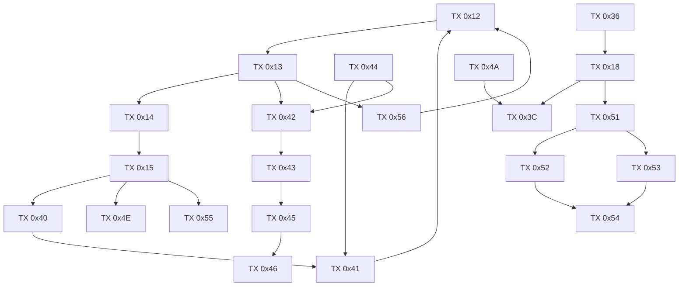
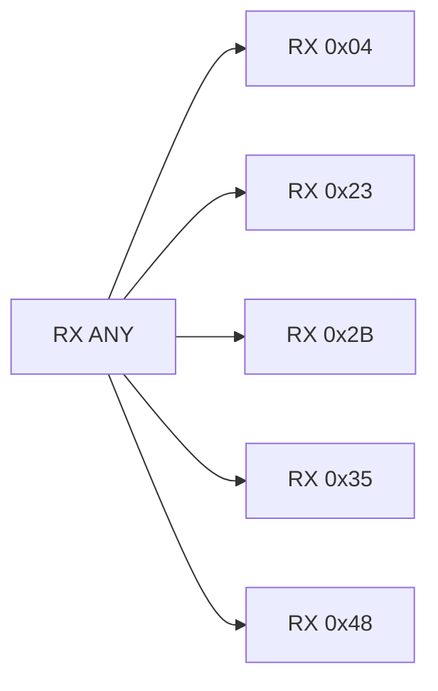
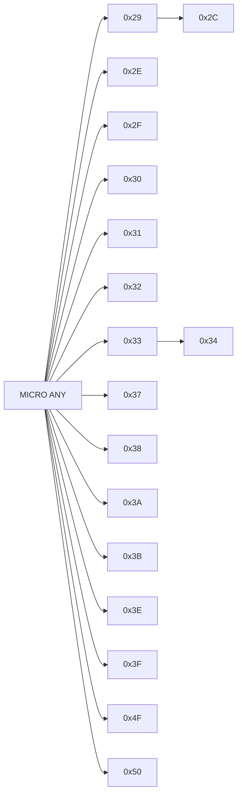

# v34handshak 3-Plane State Graph (TX/RX/Micro)

This extends the TX graph with RX and microstate planes, backed by assignment evidence.

- TX state field: `WORD [..+0x3596]`
- RX state field: `WORD [..+0x3594]`
- Microstate field: `WORD [..+0x3592]`

References:
- TX graph: `/root/D-Modem/doc/v34handshak_state_graph.md`
- RX/micro edge CSV: `/root/D-Modem/doc/v34handshak_state_graph_rx_micro_edges.csv`
- RX/micro assignment catalog: `/root/D-Modem/doc/v34handshak_rx_micro_assignment_catalog.csv`

## TX Plane (Main Paths)

## RX Plane

Evidence anchors:
- `RX 0x04`: `0x64bfd`
- `RX 0x23`: `0x64e41`
- `RX 0x2B`: `0x651e2`
- `RX 0x35`: `0x6b813`
- `RX 0x48`: `0x66456`

## Microstate Plane

Evidence anchors:
- `0x33 -> 0x34`: compare at `0x62c7f`, assignment at `0x62d2b`
- `0x29 -> 0x2C`: assignment at `0x712f8`
- `ANY -> 0x29`: `0x64db3` (many additional sites in catalog)

## Cross-Plane Coupling (Inferred)

These are control couplings, not strict single-edge FSM moves:

- TX `0x15`/`0x42`/`0x43` processing phases frequently force RX `0x04`/`0x23`/`0x2B` depending mode flags.
- TX probe and retrain branches (`0x33`, `0x3C`, `0x4A`) repeatedly reset microstate to `0x29` baseline.
- MOH TX states (`0x51`..`0x54`) correlate with micro MOH states (`0x4F`,`0x50`).

## Notes

- TX transitions are the strongest/most explicit (see TX graph doc).
- RX and micro are heavily flag- and timer-conditioned; many entries are modeled as `ANY -> state` with concrete write evidence.
- All addresses are from `v34handshak` disassembly (`/root/D-Modem/doc/v34handshak_disasm.asm`).
