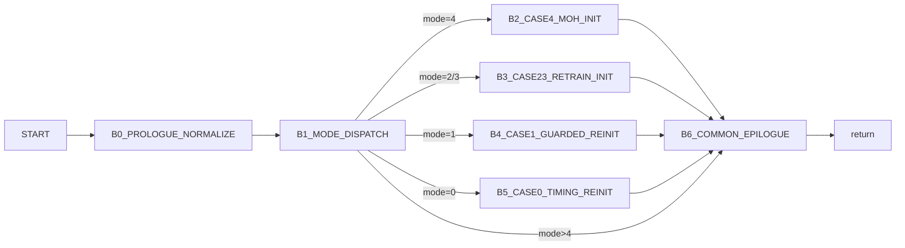

# v34handshakinit Control Graph (Address-Backed)

## Control Blocks

| Block | Entry |
|---|---:|
| `B0_PROLOGUE_NORMALIZE` | `0x5fab0` |
| `B1_MODE_DISPATCH` | `0x5fb61` |
| `B2_CASE4_MOH_INIT` | `0x5fb82` |
| `B3_CASE23_RETRAIN_INIT` | `0x5fd40` |
| `B4_CASE1_GUARDED_REINIT` | `0x5fed0` |
| `B5_CASE0_TIMING_REINIT` | `0x5ff90` |
| `B6_COMMON_EPILOGUE` | `0x5fd10` |

