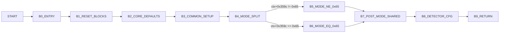

# v34modeminit Control Graph (Address-Backed)

## Control Blocks

| Block | Entry |
|---|---:|
| `B0_ENTRY` | `0x5f560` |
| `B1_RESET_BLOCKS` | `0x5f590` |
| `B2_CORE_DEFAULTS` | `0x5f5da` |
| `B3_COMMON_SETUP` | `0x5f6ac` |
| `B4_MODE_SPLIT` | `0x5f748` |
| `B5_MODE_NE_0x65` | `0x5f75c` |
| `B6_MODE_EQ_0x65` | `0x5f93f` |
| `B7_POST_MODE_SHARED` | `0x5f8b4` |
| `B8_DETECTOR_CFG` | `0x5f8f2` |
| `B9_RETURN` | `0x5f914` |

