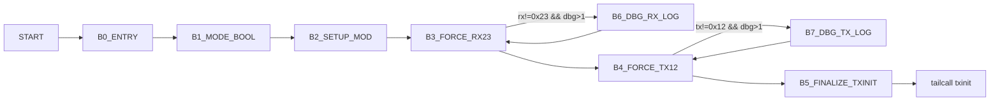

# v34setuptxmit Control Graph (Address-Backed)

## Control Blocks

| Block | Entry |
|---|---:|
| `B0_ENTRY` | `0x62720` |
| `B1_MODE_BOOL` | `0x6274a` |
| `B2_SETUP_MOD` | `0x62769` |
| `B3_FORCE_RX23` | `0x627ab` |
| `B4_FORCE_TX12` | `0x627cd` |
| `B5_FINALIZE_TXINIT` | `0x627f3` |
| `B6_DBG_RX_LOG` | `0x62820` |
| `B7_DBG_TX_LOG` | `0x62882` |

