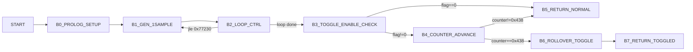

# v8_ansamgenerate Control Graph (Address-Backed)

- `from_state -> branch/target -> to_state`
- States are control blocks (`B0..B7`) anchored to disassembly addresses.

## 1) Control Blocks

| Block | Entry |
|---|---:|
| `B0_PROLOG_SETUP` | `0x77210` |
| `B1_GEN_1SAMPLE` | `0x77230` |
| `B2_LOOP_CTRL` | `0x772c0` |
| `B3_TOGGLE_ENABLE_CHECK` | `0x772d3` |
| `B4_COUNTER_ADVANCE` | `0x772da` |
| `B5_RETURN_NORMAL` | `0x772e9` |
| `B6_ROLLOVER_TOGGLE` | `0x772f1` |
| `B7_RETURN_TOGGLED` | `0x77301` |

## 2) Main Flow Graph

## 3) Edge Evidence

Edge CSV: `/root/D-Modem/doc/v8_ansamgenerate_state_graph_edges.csv`

- `B2 -> B1`: `0x772cd -> 0x77230`
- `B3 -> B5`: `0x772d8 -> 0x772e9`
- `B4 -> B6`: `0x772e3 -> 0x772f1`

## 4) Scope

- This is a local generation routine, not the high-level V.8 handshake state machine.
- Side effects are limited to phase/gain bookkeeping fields and the 4-sample output buffer.
