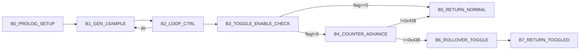
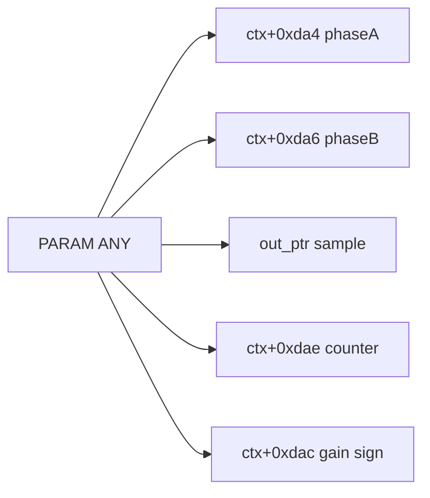
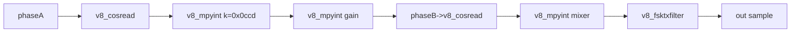

# v8_ansamgenerate 3-Plane Graph (Control/Params/Calls)

References:
- Control graph: `/root/D-Modem/doc/v8_ansamgenerate_state_graph.md`
- Control edge CSV: `/root/D-Modem/doc/v8_ansamgenerate_state_graph_edges.csv`
- Param edge CSV: `/root/D-Modem/doc/v8_ansamgenerate_state_graph_param_edges.csv`
- Assignment catalog: `/root/D-Modem/doc/v8_ansamgenerate_assignment_catalog.csv`

## Control Plane

## Parameter Plane

Evidence anchors:
- `ctx+0xda4`: `0x77246`
- `ctx+0xda6`: `0x77251`
- `out_ptr[i]`: `0x772bd`
- `ctx+0xdae`: `0x772de`, `0x772f5`
- `ctx+0xdac`: `0x772fd`

## Call Plane

## Cross-Plane Coupling

- `B1_GEN_1SAMPLE` owns all synthesis math and external calls.
- `B4_COUNTER_ADVANCE` and `B6_ROLLOVER_TOGGLE` only affect periodic phase-reversal behavior.
