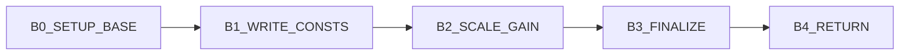
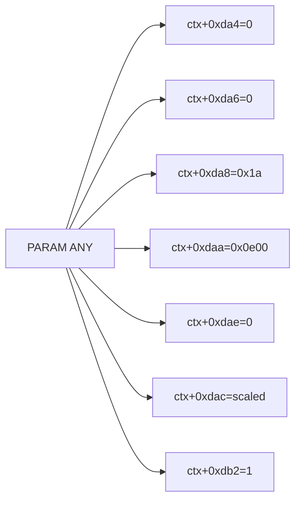

# v8_ansaminit 3-Plane Graph (Control/Params/Call)

This extends the control graph with parameter-write and call planes.

References:
- Control graph: `/root/D-Modem/doc/v8_ansaminit_state_graph.md`
- Control edge CSV: `/root/D-Modem/doc/v8_ansaminit_state_graph_edges.csv`
- Param edge CSV: `/root/D-Modem/doc/v8_ansaminit_state_graph_param_edges.csv`
- Assignment catalog: `/root/D-Modem/doc/v8_ansaminit_assignment_catalog.csv`

## Control Plane



## Parameter Plane



Evidence anchors:
- `ctx+0xda4=0`: `0x76cbf`
- `ctx+0xda6=0`: `0x76ca0`
- `ctx+0xda8=0x1a`: `0x76ca6`
- `ctx+0xdaa=0x0e00`: `0x76cac`
- `ctx+0xdae=0`: `0x76cb2`
- `ctx+0xdac=scaled`: `0x76cd6`
- `ctx+0xdb2=1`: `0x76cda`

## Call Plane

```mermaid
flowchart LR
  K0[input ctx+0xa42] --> K1[v8_mpyint(16000, x)] --> K2[store ctx+0xdac]
```

Evidence anchors:
- load input: `0x76cb8`
- call: `0x76cd1`
- store result: `0x76cd6`

## Cross-Plane Coupling

- Control block `B2_SCALE_GAIN` is the only block that touches external compute (`v8_mpyint`).
- `B3_FINALIZE` commits the computed value and arms ANSam generation (`+0xdb2=1`).
