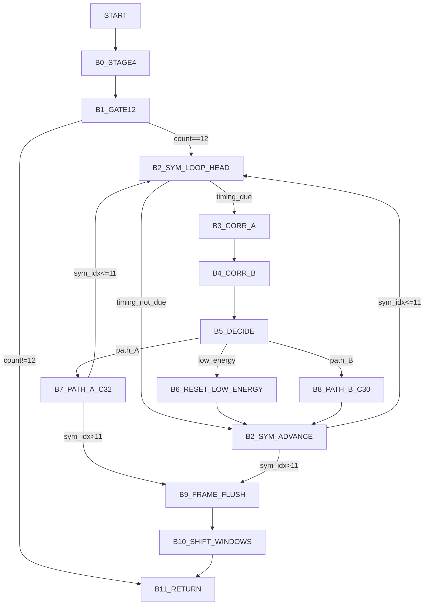

# v8_fskdemodulate Control Graph (Address-Backed)

This graph uses the same output style as the earlier handshake maps, but this function is a control pipeline (not an enum-based state machine).

- `from_state -> branch/target -> to_state`
- States are named control blocks (`B0..B11`) anchored to disassembly addresses.

## 1) Control Blocks

| Block | Entry |
|---|---:|
| `B0_STAGE4` | `0x78ca3` |
| `B1_GATE12` | `0x78ccf` |
| `B2_SYM_LOOP_HEAD` | `0x78cf4` |
| `B3_CORR_A` | `0x78d72` |
| `B4_CORR_B` | `0x78dd0` |
| `B5_DECIDE` | `0x78e1d` |
| `B6_RESET_LOW_ENERGY` | `0x78e7f` |
| `B7_PATH_A_C32` | `0x78fa9` |
| `B8_PATH_B_C30` | `0x79047` |
| `B9_FRAME_FLUSH` | `0x78ea4` |
| `B10_SHIFT_WINDOWS` | `0x78f65` |
| `B11_RETURN` | `0x78fa1` |

## 2) Main Flow Graph

## 3) Edge Evidence

Edge CSV: `/root/D-Modem/doc/v8_fskdemodulate_state_graph_edges.csv`

- Example anchors:
  - `B1 -> RETURN`: `0x78cd4` (not equal branch)
  - `B1 -> B2`: `0x78cd4` (equal branch)
  - `B5 -> B7`: `0x78e74`
  - `B5 -> B8`: `0x78e6e`
  - `ADV -> B2/F`: `0x78e9e`

## 4) Scope

- This graph focuses on control flow.
- Counter and bit-output behavior are split into:
  - `/root/D-Modem/doc/v8_fskdemodulate_state_graph_counter_edges.csv`
  - `/root/D-Modem/doc/v8_fskdemodulate_state_graph_3plane.md`
