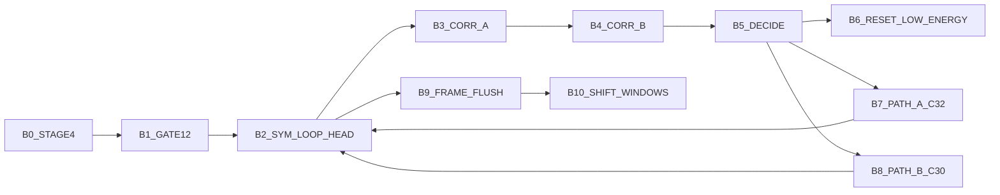
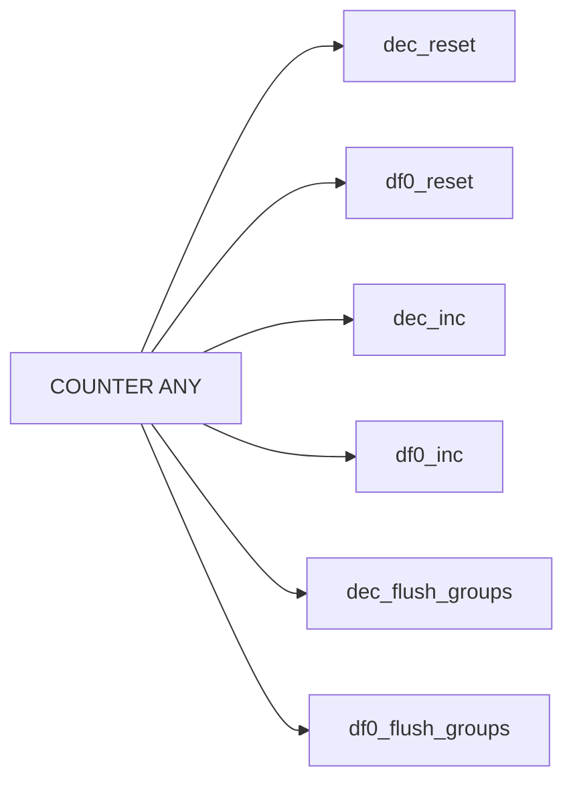
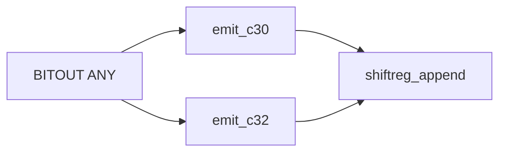

# v8_fskdemodulate 3-Plane Graph (Control/Counters/Bit Output)

This extends the main control graph with counter and bit-output planes.

References:
- Control graph: `/root/D-Modem/doc/v8_fskdemodulate_state_graph.md`
- Control edge CSV: `/root/D-Modem/doc/v8_fskdemodulate_state_graph_edges.csv`
- Counter/bit edge CSV: `/root/D-Modem/doc/v8_fskdemodulate_state_graph_counter_edges.csv`
- Assignment catalog: `/root/D-Modem/doc/v8_fskdemodulate_assignment_catalog.csv`

## Control Plane

## Counter Plane

Evidence anchors:
- `dec_reset`: `0x78e85`, `0x79025`
- `df0_reset`: `0x78e8d`, `0x78eb8`, `0x7905d`
- `dec_inc`: `0x790c1`
- `df0_inc`: `0x7902f`

## Bit-Output Plane

Evidence anchors:
- `emit_c30`: `0x78ed3`, `0x7909c`
- `emit_c32`: `0x78f23`, `0x78ffe`
- `shiftreg_append`: `0x78ed7`, `0x78f29`, `0x79002`, `0x790a0`

## Cross-Plane Coupling

- `B5_DECIDE` selects whether grouped run flush emits `c30` or `c32` bits.
- `B9_FRAME_FLUSH` guarantees residual run groups are emitted before phase/window shift.
- `B10_SHIFT_WINDOWS` prepares next invocation’s sample history (`+0xdf4/+0xe5c` backing windows).
