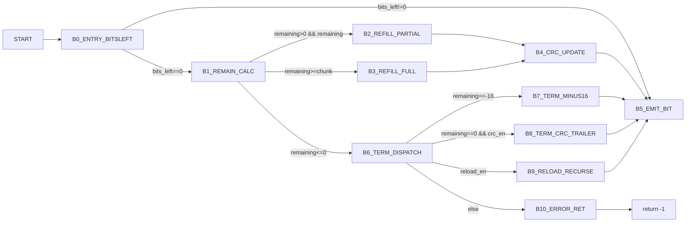

# v8_getbit Control Graph (Address-Backed)

## Control Blocks

| Block | Entry |
|---|---:|
| `B0_ENTRY_BITSLEFT` | `0x754b0` |
| `B1_REMAIN_CALC` | `0x754d4` |
| `B2_REFILL_PARTIAL` | `0x754fc` |
| `B3_REFILL_FULL` | `0x755a0` |
| `B4_CRC_UPDATE` | `0x75524` |
| `B5_EMIT_BIT` | `0x75571` |
| `B6_TERM_DISPATCH` | `0x755d6` |
| `B7_TERM_MINUS16` | `0x75624` |
| `B8_TERM_CRC_TRAILER` | `0x75651` |
| `B9_RELOAD_RECURSE` | `0x755ed` |
| `B10_ERROR_RET` | `0x755e1` |

