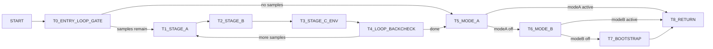

# v8_tone_detect Control Graph (Address-Backed)

## Control Blocks

| Block | Entry |
|---|---:|
| `T0_ENTRY_LOOP_GATE` | `0x78650` |
| `T1_STAGE_A` | `0x78670` |
| `T2_STAGE_B` | `0x78710` |
| `T3_STAGE_C_ENV` | `0x7877a` |
| `T4_LOOP_BACKCHECK` | `0x787fb` |
| `T5_MODE_A` | `0x7880c` |
| `T6_MODE_B` | `0x7884d` |
| `T7_BOOTSTRAP` | `0x78869` |
| `T8_RETURN` | `0x78843` |

