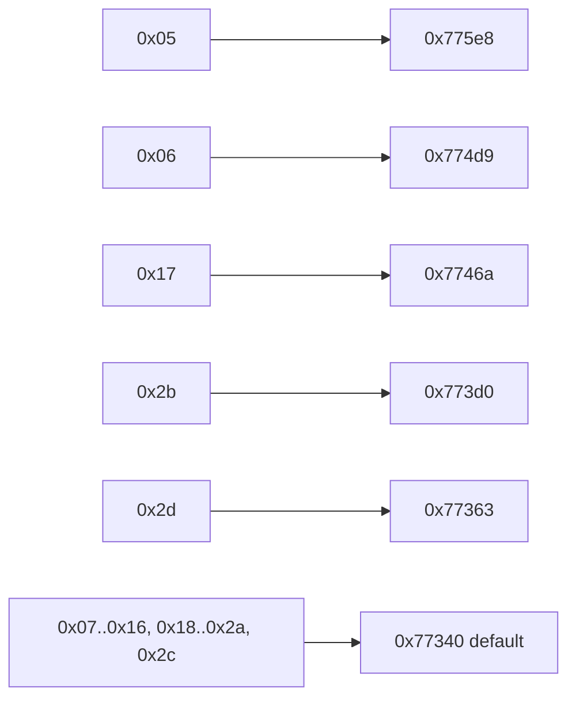
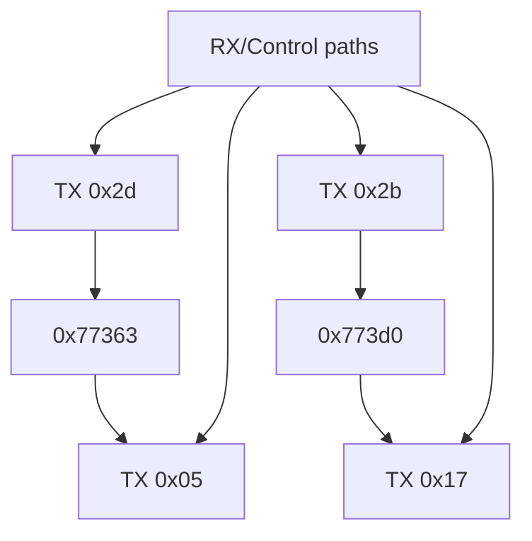

# v8handshak TX State Graph (Address-Backed)

This graph is organized as:

- `from_state -> dispatch_target -> next_state(s)`
- Dispatch target comes from jump table A (`.rodata+0x5680`) at `0x7735c`.
- Next-state edges are backed by concrete assignment sites (`mov WORD PTR [..+0x9d4], imm/reg`).

## 1) State -> Dispatch Target (Exact)

## 2) Dispatch/Control Target -> Next TX State(s) (Evidence-Backed)

Legend:
- `H` high confidence (direct assignment in a strongly scoped path)
- `M` medium confidence (shared control path; trigger is conditional)

| Dispatch/Control target | Next TX state | Evidence assignment addr | Confidence | Notes |
|---:|---:|---:|---|---|
| `0x773d0` (`TX 0x2b`) | `0x17` | `0x77a4b` | H | QC preamble transmit completes (`count==0x3c`) and switches to main FSK message TX |
| `0x77363` (`TX 0x2d`) | `0x05` | `0x77dfc -> 0x77e0b` | H | ANSam/QCA completion path forces terminal TX state |
| `rx-path` | `0x2d` | `0x77c58` | M | ANSam detect gate enters ANSam tone TX |
| `rx-path` | `0x2b` | `0x77d85` | H | QC-capable branch enters QC preamble TX |
| `rx-path` | `0x17` | `0x77d46 \| 0x7804a \| 0x782dc` | M | Multiple negotiation branches enter/return to FSK message TX |
| `rx-path` | `0x05` | `0x777ef \| 0x77ed9 \| 0x77fec \| 0x781c1` | M | Terminal success/failure paths force TX state `0x05` |

## 3) Compact Combined Graph (Main Paths)

## 4) Scope

- TX-focused (`field+0x9d4`) as requested.
- RX (`field+0x9d6`) and substate (`field+0x9d8`) edges are in:
  - `/root/D-Modem/doc/v8handshak_state_graph_rx_micro_edges.csv`
  - `/root/D-Modem/doc/v8handshak_state_graph_3plane.md`
