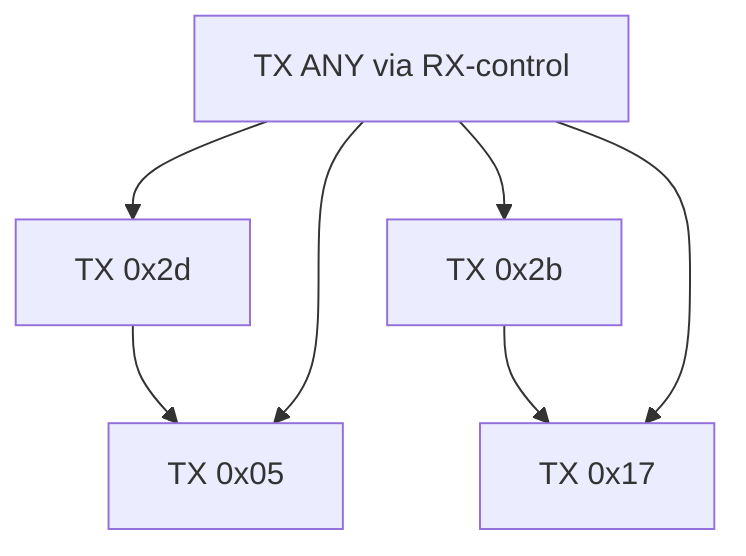
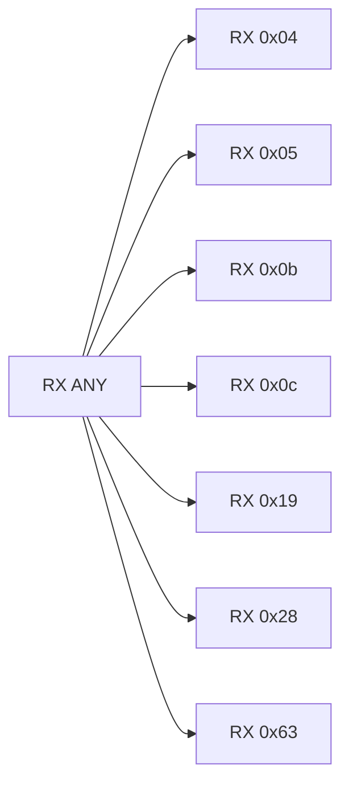
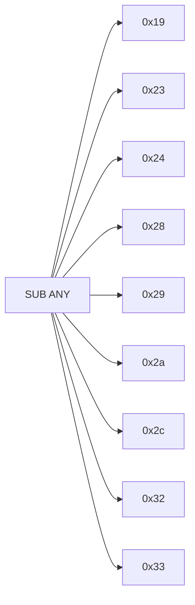

# v8handshak 3-Plane State Graph (TX/RX/Substate)

This extends the TX graph with RX and substate planes, backed by assignment evidence.

- TX state field: `WORD [..+0x9d4]`
- RX state field: `WORD [..+0x9d6]`
- Substate field: `WORD [..+0x9d8]`

References:
- TX graph: `/root/D-Modem/doc/v8handshak_state_graph.md`
- RX/substate edge CSV: `/root/D-Modem/doc/v8handshak_state_graph_rx_micro_edges.csv`
- RX/substate assignment catalog: `/root/D-Modem/doc/v8handshak_rx_micro_assignment_catalog.csv`

## TX Plane (Main Paths)

## RX Plane

Evidence anchors:
- `RX 0x04`: `0x77adc`
- `RX 0x05`: `0x77cda`
- `RX 0x0b`: `0x77e34`
- `RX 0x0c`: `0x77a79`
- `RX 0x19`: `0x77ffa`
- `RX 0x28`: `0x778f4`, `0x77d68`
- `RX 0x63`: `0x77e12`, `0x77ee5`, `0x781cd`

## Substate Plane

Evidence anchors:
- `0x19`: `0x77ff3`
- `0x23`: `0x7837b`
- `0x24`: `0x77b59`
- `0x28`: `0x77e82`
- `0x29`: `0x778fb`, `0x77d6f`, `0x781f7`
- `0x2a`: `0x782d5`
- `0x2c`: `0x77bee`
- `0x32`: `0x7839a`
- `0x33`: `0x78389`

## Cross-Plane Coupling (Inferred)

- RX ANSam/QCA detection moves TX into `0x2d` or `0x2b`, then TX returns to `0x17`/`0x05`.
- RX terminal state `0x63` and TX state `0x05` are commonly co-set on completion/error exits.
- Substate `0x29` is the dominant receive baseline; `0x2a/0x32/0x33` are JM-sequence decision branches.
