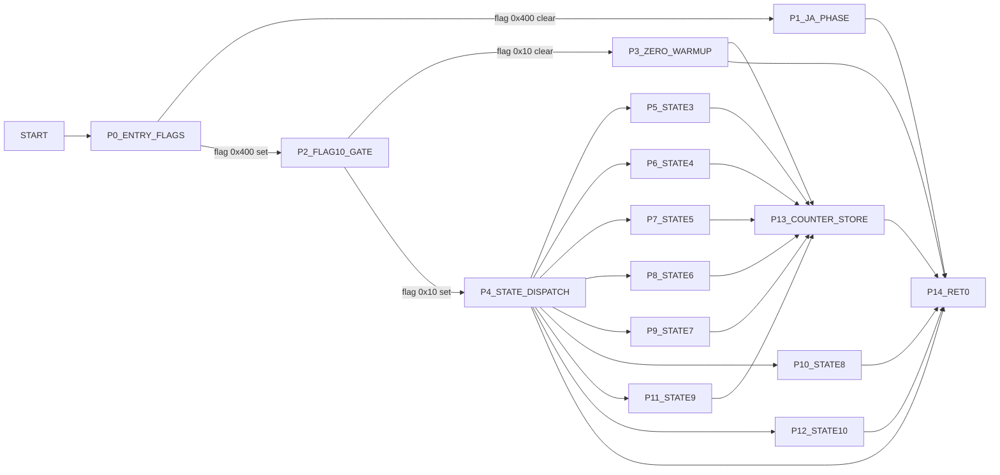

# v90Phase34 Control Graph (Address-Backed)

## Control Blocks

| Block | Entry |
|---|---:|
| `P0_ENTRY_FLAGS` | `0x9be0` |
| `P1_JA_PHASE` | `0x9ce0` |
| `P2_FLAG10_GATE` | `0x9c1c` |
| `P3_ZERO_WARMUP` | `0x9c86` |
| `P4_STATE_DISPATCH` | `0x9c20` |
| `P5_STATE3` | `0x9d92` |
| `P6_STATE4` | `0x9df7` |
| `P7_STATE5` | `0x9d50` |
| `P8_STATE6` | `0x9ee5` |
| `P9_STATE7` | `0x9e4d` |
| `P10_STATE8` | `0x9f3d` |
| `P11_STATE9` | `0x9ec0` |
| `P12_STATE10` | `0x9fa3` |
| `P13_COUNTER_STORE` | `0x9cbc` |
| `P14_RET0` | `0x9c70` |

