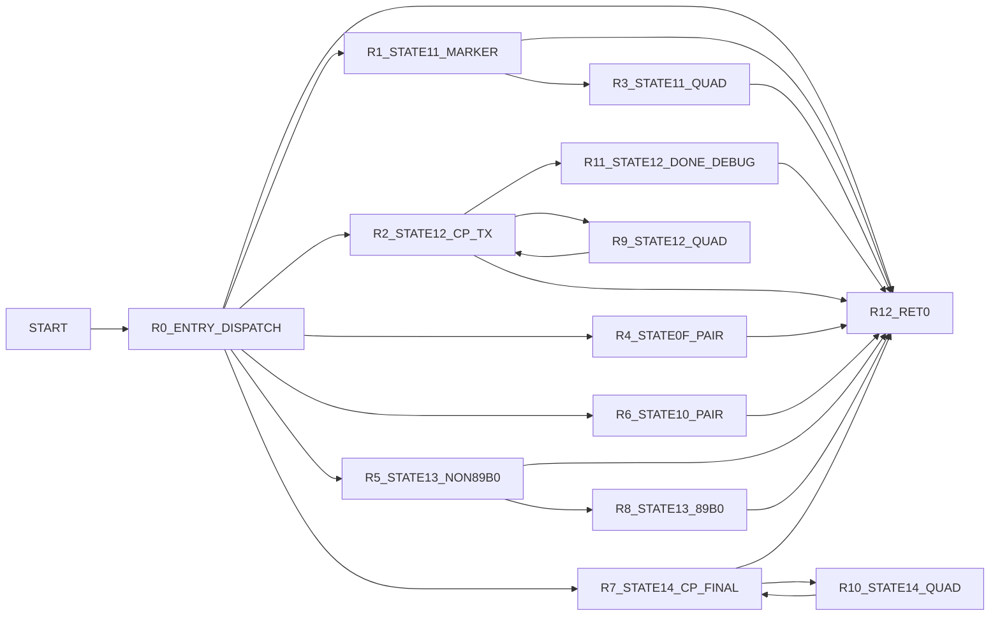

# v90RateRenegSilence Control Graph (Address-Backed)

## Control Blocks

| Block | Entry |
|---|---:|
| `R0_ENTRY_DISPATCH` | `0x95d0` |
| `R1_STATE11_MARKER` | `0x9646` |
| `R2_STATE12_CP_TX` | `0x968b` |
| `R3_STATE11_QUAD` | `0x9708` |
| `R4_STATE0F_PAIR` | `0x9720` |
| `R5_STATE13_NON89B0` | `0x9780` |
| `R6_STATE10_PAIR` | `0x9805` |
| `R7_STATE14_CP_FINAL` | `0x9877` |
| `R8_STATE13_89B0` | `0x9902` |
| `R9_STATE12_QUAD` | `0x9966` |
| `R10_STATE14_QUAD` | `0x997e` |
| `R11_STATE12_DONE_DEBUG` | `0x9996` |
| `R12_RET0` | `0x9630` |

