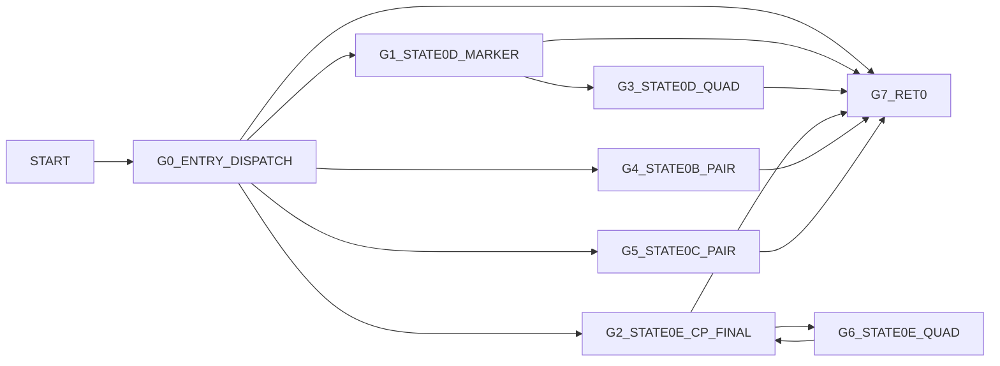

# v90RateReneg Control Graph (Address-Backed)

## Control Blocks

| Block | Entry |
|---|---:|
| `G0_ENTRY_DISPATCH` | `0x99b0` |
| `G1_STATE0D_MARKER` | `0x9a14` |
| `G2_STATE0E_CP_FINAL` | `0x9a59` |
| `G3_STATE0D_QUAD` | `0x9ad3` |
| `G4_STATE0B_PAIR` | `0x9af0` |
| `G5_STATE0C_PAIR` | `0x9b50` |
| `G6_STATE0E_QUAD` | `0x9bc3` |
| `G7_RET0` | `0x99fe` |

