# vpcm_create Control Graph (Address-Backed)

- `from_state -> branch/target -> to_state`
- States are control blocks (`B0..B19`) anchored to disassembly addresses.

## 1) Control Blocks

| Block | Entry |
|---|---:|
| `B0_VALIDATE` | `0x3a00` |
| `B1_DBG_CREATE` | `0x3c90` |
| `B2_FRAG_ALLOC` | `0x3a37` |
| `B3_INIT_BASE` | `0x3a5a` |
| `B4_CREATE_XF` | `0x3ae7` |
| `B5_CREATE_K56` | `0x3b10` |
| `B6_RATE_LIMITS` | `0x3b39` |
| `B7_DBG_RATE` | `0x3d22` |
| `B8_FLAGS_MODE` | `0x3b80` |
| `B9_DELAY_ADJUST` | `0x3be5` |
| `B10_DELAY_NEG` | `0x3d6f` |
| `B11_DBG_DELAY` | `0x3d00` |
| `B12_SESSION_TYPE` | `0x3c27` |
| `B13_DBG_SESSION` | `0x3ce0` |
| `B14_CREATE_V34` | `0x3c52` |
| `B15_RET_SUCCESS` | `0x3c77` |
| `B16_CLEANUP_XF` | `0x3cbe` |
| `B17_CLEANUP_BOTH` | `0x3da8` |
| `B18_FREE_RET_NULL` | `0x3ccc` |
| `B19_RET_NULL` | `0x3c7f` |

## 2) Main Flow Graph

```mermaid
flowchart LR
  START --> B0[B0_VALIDATE]
  B0 -->|dbg>1| B1[B1_DBG_CREATE]
  B1 --> B2[B2_FRAG_ALLOC]
  B0 -->|dbg<=1| B2
  B0 -->|sample_rate!=9600| B19[B19_RET_NULL]

  B2 -->|frag>0x30 or malloc fail| B19
  B2 --> B3[B3_INIT_BASE]
  B3 --> B4[B4_CREATE_XF]
  B4 -->|xf_fail| B18[B18_FREE_RET_NULL]
  B4 --> B5[B5_CREATE_K56]
  B5 -->|k56_fail| B16[B16_CLEANUP_XF]
  B5 --> B6[B6_RATE_LIMITS]

  B6 -->|dbg>1| B7[B7_DBG_RATE]
  B7 --> B8[B8_FLAGS_MODE]
  B6 -->|dbg<=1| B8

  B8 --> B9[B9_DELAY_ADJUST]
  B9 -->|negative| B10[B10_DELAY_NEG]
  B10 --> B12[B12_SESSION_TYPE]
  B9 -->|dbg delay| B11[B11_DBG_DELAY]
  B11 --> B12
  B9 -->|normal| B12

  B12 -->|dbg session| B13[B13_DBG_SESSION]
  B13 --> B14[B14_CREATE_V34]
  B12 -->|no dbg session| B14

  B14 -->|success| B15[B15_RET_SUCCESS]
  B14 -->|fail| B17[B17_CLEANUP_BOTH]
  B17 --> B18
  B16 --> B18
```

## 3) Scope

- Constructor-style function with strong fail-fast and cleanup behavior.
- Control graph includes all debug-only side branches because they alter control edges.
