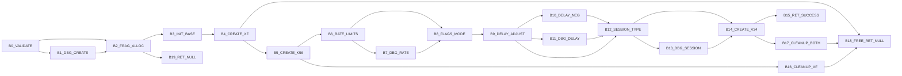
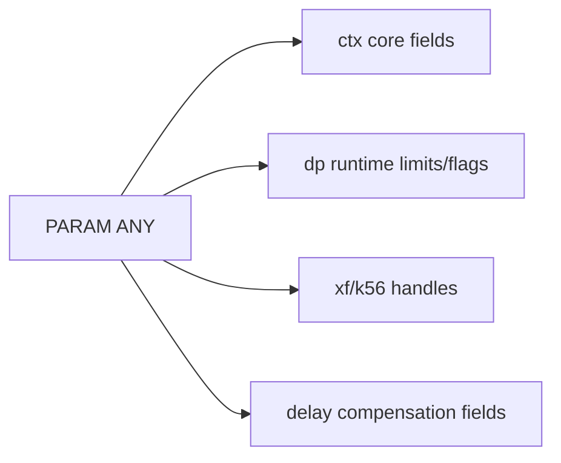
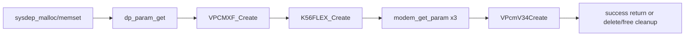

# vpcm_create 3-Plane Graph (Control/Params/Calls)

References:
- Control graph: `/root/D-Modem/doc/vpcm_create_state_graph.md`
- Control edge CSV: `/root/D-Modem/doc/vpcm_create_state_graph_edges.csv`
- Param edge CSV: `/root/D-Modem/doc/vpcm_create_state_graph_param_edges.csv`
- Assignment catalog: `/root/D-Modem/doc/vpcm_create_assignment_catalog.csv`

## Control Plane

## Parameter Plane

Representative evidence:
- core fields: `0x3a76..0x3acf`
- handles: `0x3b02`, `0x3b2b`
- dp limits/flags: `0x3b8a..0x3bbf`
- delay fields: `0x3c03..0x3c2c`, `0x3d98`

## Call Plane

## Cross-Plane Coupling

- `B14_CREATE_V34` decides final success pointer vs cascading cleanup.
- Delay/flags writes in `B8/B9/B10/B12` directly shape runtime behavior for downstream modem processing.
