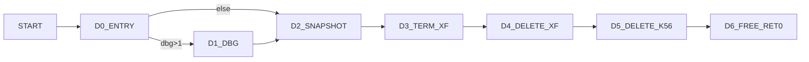

# vpcm_delete Control Graph (Address-Backed)

## Control Blocks

| Block | Entry |
|---|---:|
| `D0_ENTRY` | `0x3dd0` |
| `D1_DBG` | `0x3e30` |
| `D2_SNAPSHOT` | `0x3de4` |
| `D3_TERM_XF` | `0x3df5` |
| `D4_DELETE_XF` | `0x3e03` |
| `D5_DELETE_K56` | `0x3e11` |
| `D6_FREE_RET0` | `0x3e1f` |

