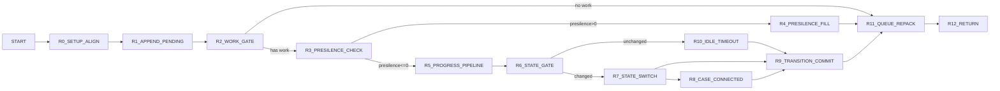

# vpcm_run Control Graph (Address-Backed)

## Control Blocks

| Block | Entry |
|---|---:|
| `R0_SETUP_ALIGN` | `0x3e40` |
| `R1_APPEND_PENDING` | `0x3e84` |
| `R2_WORK_GATE` | `0x3eb6` |
| `R3_PRESILENCE_CHECK` | `0x3ed2` |
| `R4_PRESILENCE_FILL` | `0x3eea` |
| `R5_PROGRESS_PIPELINE` | `0x3fb7` |
| `R6_STATE_GATE` | `0x4157` |
| `R7_STATE_SWITCH` | `0x4171` |
| `R8_CASE_CONNECTED` | `0x43e1` |
| `R9_TRANSITION_COMMIT` | `0x4210` |
| `R10_IDLE_TIMEOUT` | `0x4268` |
| `R11_QUEUE_REPACK` | `0x3f19` |
| `R12_RETURN` | `0x3faf` |

